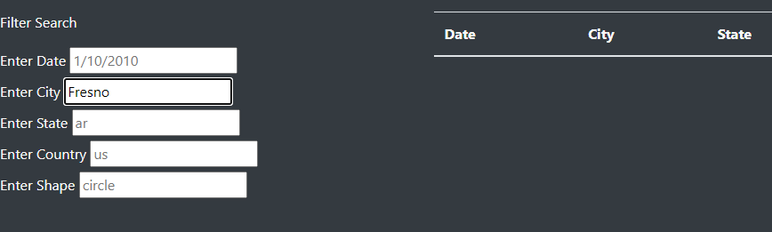
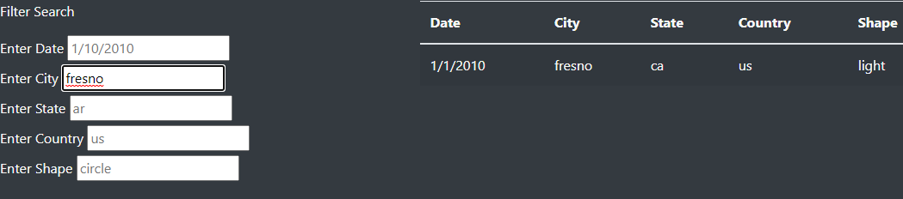

# Analysis of UFO Website
Prepared by Robert Gallagher

## Overview
The purpose of this project was to build a website that inlcudes an article and a large data set about UFOs.  And then allows the user to filter the data set on various items in the data table.

## Results
By entering values into the filter input boxes on the left of the screen the user can filter the data table to the right.
- Example

## Summary
- The current filter functionality is case sensitive.

- I recomend improving the filter logic to eleminate case sensitivity.

- In addition it would be nice to add some visulizations of the data like a heat map based on ufo time near the various locations.  Or bar charts by shape.

